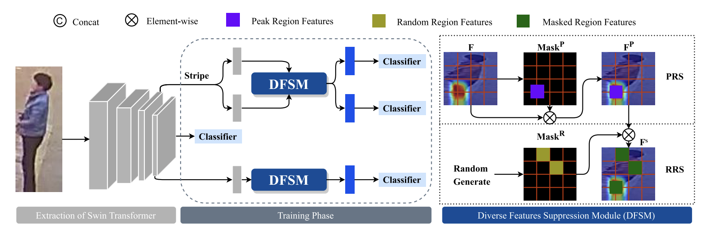

# 🎉🎉🎉 Diverse Features Discovery Transformer for Pedestrian Attribute Recognition
This repository is an official implementation of the paper [DFDT](https://aihuazheng.github.io/publications/pdf/2023/2023-Diverse_features_discovery_transformer_for_pedestrian_attribute_recognition.pdf).

## ☀️ Introduction


**Abstract.** Recently, Swin Transformer has been widely explored as a general backbone for computer vision, which helps to improve the performance of vision tasks due to the ability to establish associations for long-range dependencies of different spatial locations. By implementing the pedestrian attribute recognition with Swin Transformer, we observe that Swin Transformer tends to focus on a relatively small number of local regions within which attributes may be correlated with other attributes, which leads Swin Transformer to predict attributes in those neglected regions based on such correlation. In fact, discriminative information may exist within these neglected regions, which is crucial for attribute identification. To address this problem, we propose a novel diverse features discovery transformer (DFDT) which can find more attribute relationship regions for robust pedestrian attribute recognition. First, Swin Transformer is used as a feature extraction network to acquire attribute features with the long-distance association, which predicts the corresponding attribute information. Second, we propose a diverse features suppression module (DFSM) to obtain semantic features directly associated with attributes by suppressing the peak locations of the most discriminative features and randomly selected feature regions to spread the feature regions that Swin Transformer is interested in. Third, we plug the diverse features suppression module into different stages of Swin Transformer to learn detailed texture features to help recognition. In addition, we have divided the attribute features into multiple vertical feature regions to improve the focus on local attribute features. Experiments on three benchmark datasets validate the effectiveness of the proposed algorithm.

### 🛠️ How to use this code: 
### 🔥 Training & 💡 Testing: 
```
python train.py
```
### 📑 Citing DFDT
If you find DFDT useful in your research, please consider citing:

```
@inproceedings{aihuazheng2023DFDT,
  title={Diverse features discovery transformer for pedestrian attribute recognition},
  author={Aihua Zheng, Huimin Wang, Jiaxiang Wang, Huaibo Huang, Ran He, Amir Hussain},
  journal={Eng. Appl. Artif. Intell.},
  volume={119},
  pages={105708},
  year={2023},
  url={https://doi.org/10.1016/j.engappai.2022.105708},
  doi={10.1016/j.engappai.2022.105708}
}
```